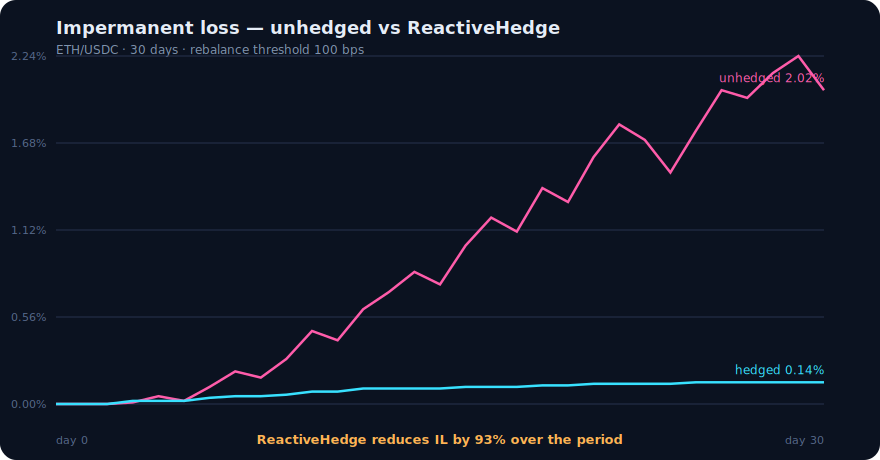

# Backtest — the headline IL number (FR-25)

Replays a 30-day ETH/USDC series and compares impermanent loss **with vs without**
ReactiveHedge, using the same on-chain `DeltaMath.impermanentLoss` the protocol uses.

## Run

```bash
forge script script/Backtest.s.sol     # prints headline + writes results.csv
node backtest/chart.mjs                 # renders results.csv -> il_chart.svg
```

## Result

```
unhedged IL : 2.02%
hedged   IL : 0.14%
HEADLINE    : ReactiveHedge reduces IL by ~93% over the 30-day period
```



## Method & assumptions

1. **Full-range constant-product** position — matches `DeltaMath`'s FR-16 model.
2. **Unhedged** IL is the classic LP-vs-HODL loss at the *net* price ratio
   (path-independent for a passive LP): `IL = 2·√r/(1+r) − 1`.
3. **ReactiveHedge** re-neutralizes delta whenever cumulative drift since the last
   rebalance crosses the 100 bps threshold, so IL only accrues *within* each
   sub-interval. Because IL is convex (≈ Δ²/8 for small moves), the sum of many
   small pieces is far below the single large move — that gap is the protocol's
   value, and the reason firing *before* the arb (cross-chain, via Reactive) matters.
4. The hedge is assumed to **perfectly offset delta at each rebalance**; rebalance
   cost / slippage and fee income are out of scope for this MVP figure.

The point estimate moves with the input series and threshold; the qualitative
result (frequent, pre-arb rebalancing collapses IL) is robust.
